This post discusses moving average crossover strategies,backtesting, and benchmarking

**NOTE: The information in this post is of a general nature containing information and opinions from the author’s perspective. None of the content of this post should be considered financial advice. Furthermore, any code written here is provided without any form of guarantee. Individuals who choose to use it do so at their own risk.**

## Trading Strategy

Call an **open position** a trade that will be terminated in the future when a condition is met. A **long** position is one in which a profit is made if the financial instrument traded increases in value, and a **short** position is on in which a profit is made if the financial asset being traded decreases in value. When trading stocks directly, all long positions are bullish and all short position are bearish. That said, a bullish attitude need not be accompanied by a long position, and a bearish attitude need not be accompanied by a short position (this is particularly true when trading stock options).

Here is an example. Let’s say you buy a stock with the expectation that the stock will increase in value, with a plan to sell the stock at a higher price. This is a long position: you are holding a financial asset for which you will profit if the asset increases in value. Your potential profit is unlimited, and your potential losses are limited by the price of the stock since stock prices never go below zero. On the other hand, if you expect a stock to decrease in value, you may borrow the stock from a brokerage firm and sell it, with the expectation of buying the stock back later at a lower price, thus earning you a profit. This is called **shorting a stock**, and is a short position, since you will earn a profit if the stock drops in value. The potential profit from shorting a stock is limited by the price of the stock (the best you can do is have the stock become worth nothing; you buy it back for free), while the losses are unlimited, since you could potentially spend an arbitrarily large amount of money to buy the stock back. Thus, a broker will expect an investor to be in a very good financial position before allowing the investor to short a stock.

Any trader must have a set of rules that determine how much of her money she is willing to bet on any single trade. For example, a trader may decide that under no circumstances will she risk more than 10% of her portfolio on a trade. Additionally, in any trade, a trader must have an **exit strategy**, a set of conditions determining when she will exit the position, for either profit or loss. A trader may set a **target**, which is the minimum profit that will induce the trader to leave the position. Likewise, a trader must have a maximum loss she is willing to tolerate; if potential losses go beyond this amount, the trader will exit the position in order to prevent any further loss (this is usually done by setting a **stop-loss order**, an order that is triggered to prevent further losses).

We will call a plan that includes trading signals for prompting trades, a rule for deciding how much of the portfolio to risk on any particular strategy, and a complete exit strategy for any trade an overall **trading strategy**. Our concern now is to design and evaluate trading strategies.

We will suppose that the amount of money in the portfolio involved in any particular trade is a fixed proportion; 10% seems like a good number. We will also say that for any trade, if losses exceed 20% of the value of the trade, we will exit the position. Now we need a means for deciding when to enter position and when to exit for a profit.

Here, I will be demonstrating a [moving average crossover strategy](http://www.investopedia.com/university/movingaverage/movingaverages4.asp). We will use two moving averages, one we consider “fast”, and the other “slow”. The strategy is:

*    Trade the asset when the fast moving average crosses over the slow moving average.
*    Exit the trade when the fast moving average crosses over the slow moving average again.

A long trade will be prompted when the fast moving average crosses from below to above the slow moving average, and the trade will be exited when the fast moving average crosses below the slow moving average later. A short trade will be prompted when the fast moving average crosses below the slow moving average, and the trade will be exited when the fast moving average later crosses above the slow moving average.

We now have a complete strategy. But before we decide we want to use it, we should try to evaluate the quality of the strategy first. The usual means for doing so is backtesting, which is looking at how profitable the strategy is on historical data. For example, looking at the above chart’s performance on Apple stock, if the 20-day moving average is the fast moving average and the 50-day moving average the slow, this strategy does not appear to be very profitable, at least not if you are always taking long positions.

(You may not see all of these packages being loaded in the session; they may get loaded when other packages are loaded.)

First, let’s recreate some of our earlier charts. (I’m going to use different methods for recreating these charts, both for diversity and because some functions we’ll be using later will be introduced this way. The method used is actually more general than what was used in part 1.)


```R
if (!require("TTR")) {
  install.packages("TTR")
  library(TTR)
}

install.packages("devtools")
require("devtools")
install_github("braverock/blotter") # dependency
install_github("braverock/quantstrat")

if (!require("IKTrading")) {
  if (!require("devtools")) {
    install.packages("devtools")
  }
  library(devtools)
  install_github("IlyaKipnis/IKTrading")
  library(IKTrading)
}
library(quantmod)

#if (!require("Quandl")) {
#    install.packages("Quandl")
#}

start <- as.Date("2010-01-01")
end <- as.Date("2016-10-01")

# Let's get Apple stock data; Apple's ticker symbol is AAPL. We use the quantmod function getSymbols, and pass a string as a first argument to identify the desired ticker symbol, pass "yahoo" to src for Yahoo! Finance, and from and to specify date ranges

#Quandl.api_key("5PgwbJYXkcVZgpEs9byv")
#AAPL <- Quandl(c("MF1", "WIKI/AAPL.4"),
#                    type = "xts",
#                    collapse = "daily",  
#                    start_date="2010-01-01",
#                    end_date="2016-10-01")

# Start with daily data. Note that "type = raw" will download a data frame.

# The default behavior for getSymbols is to load data directly into the global environment, with the object being named after the loaded ticker symbol. This feature may become deprecated in the future, but we exploit it now.

getSymbols("AAPL", src="yahoo", from = start, to = end)

```

    Warning message:
    "package 'devtools' is in use and will not be installed"Skipping install of 'blotter' from a github remote, the SHA1 (bc75cf57) has not changed since last install.
      Use `force = TRUE` to force installation
    Skipping install of 'quantstrat' from a github remote, the SHA1 (be01b350) has not changed since last install.
      Use `force = TRUE` to force installation


'AAPL'


```R
# What is AAPL?
class(AAPL)
```


<ol class=list-inline>
	<li>'xts'</li>
	<li>'zoo'</li>
</ol>


```R
# Let's see the first few rows
head(AAPL)
```


               AAPL.Open AAPL.High AAPL.Low AAPL.Close AAPL.Volume AAPL.Adjusted
    2010-01-04  30.49000  30.64286 30.34000   30.57286   123432400      20.38607
    2010-01-05  30.65714  30.79857 30.46429   30.62571   150476200      20.42132
    2010-01-06  30.62571  30.74714 30.10714   30.13857   138040000      20.09649
    2010-01-07  30.25000  30.28571 29.86429   30.08286   119282800      20.05934
    2010-01-08  30.04286  30.28571 29.86572   30.28286   111902700      20.19270
    2010-01-11  30.40000  30.42857 29.77857   30.01572   115557400      20.01457


```R
candleChart(AAPL, up.col = "black", dn.col = "red", theme = "white", subset = "2016-01-04/")

AAPL_sma_20 <- SMA(
  Cl(AAPL),  # The closing price of AAPL, obtained by quantmod's Cl() function
  n = 20     # The number of days in the moving average window
  )

AAPL_sma_50 <- SMA(
  Cl(AAPL),
  n = 50
  )

AAPL_sma_200 <- SMA(
  Cl(AAPL),
  n = 200
  )

zoomChart("2016")  # Zoom into the year 2016 in the chart
addTA(AAPL_sma_20, on = 1, col = "red")  # on = 1 plots the SMA with price
addTA(AAPL_sma_50, on = 1, col = "blue")
addTA(AAPL_sma_200, on = 1, col = "green")
```


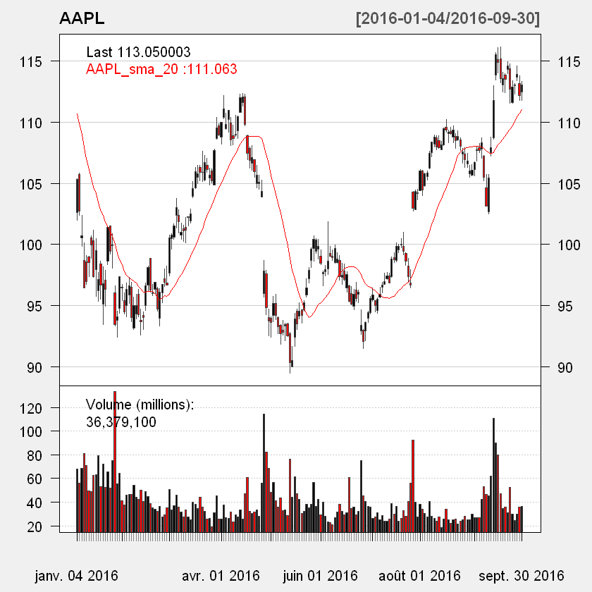


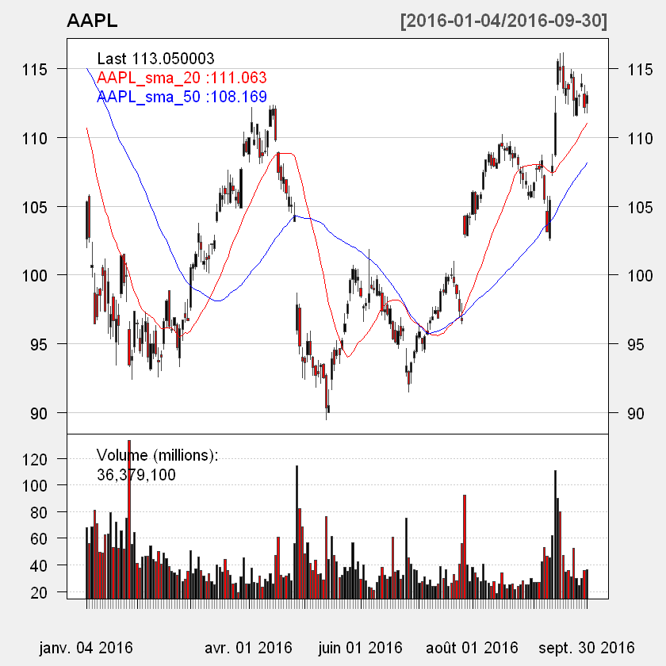


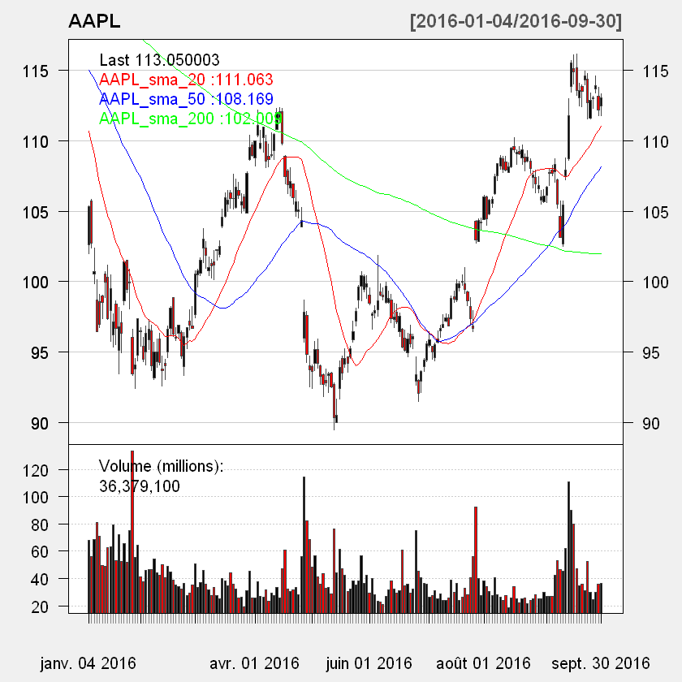


We will refer to the sign of this difference as the **regime**; that is, if the fast moving average is above the slow moving average, this is a bullish regime (the bulls rule), and a bearish regime (the bears rule) holds when the fast moving average is below the slow moving average. I identify regimes with the following code.


```R
AAPL_trade <- AAPL
AAPL_trade$`20d` <- AAPL_sma_20
AAPL_trade$`50d` <- AAPL_sma_50

regime_val <- sigComparison("", data = AAPL_trade,
                            columns = c("20d", "50d"), relationship = "gt") -
              sigComparison("", data = AAPL_trade,
                            columns = c("20d", "50d"), relationship = "lt")

plot(regime_val["2016"], main = "Regime", ylim = c(-2, 2))
```


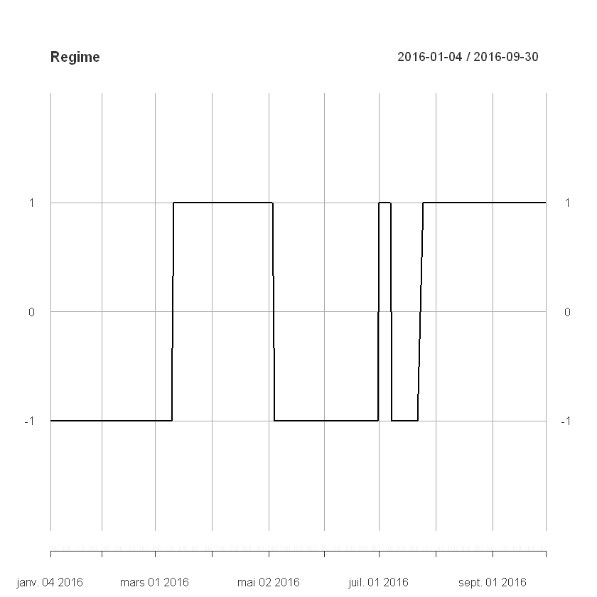


```R
plot(regime_val, main = "Regime", ylim = c(-2, 2))
```


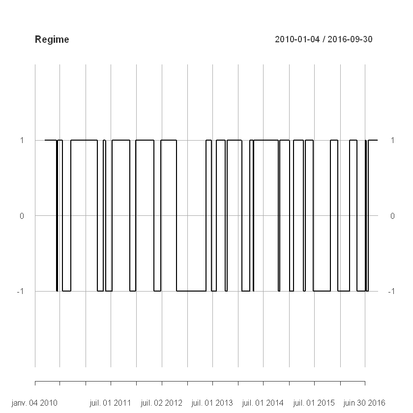


```R
candleChart(AAPL, up.col = "black", dn.col = "red", theme = "white", subset = "2016-01-04/")
addTA(regime_val, col = "blue", yrange = c(-2, 2))
addLines(h = 0, col = "black", on = 3)
addSMA(n = c(20, 50), on = 1, col = c("red", "blue"))
zoomChart("2016")
```


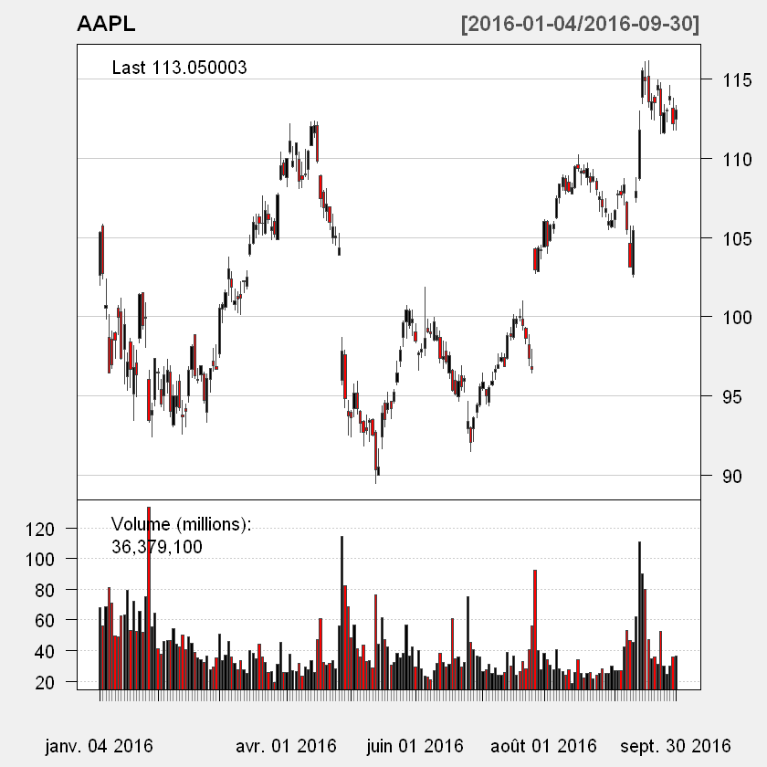


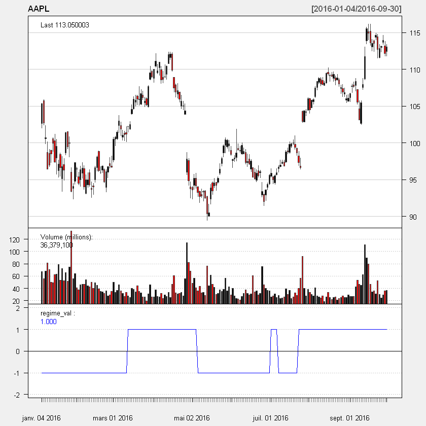


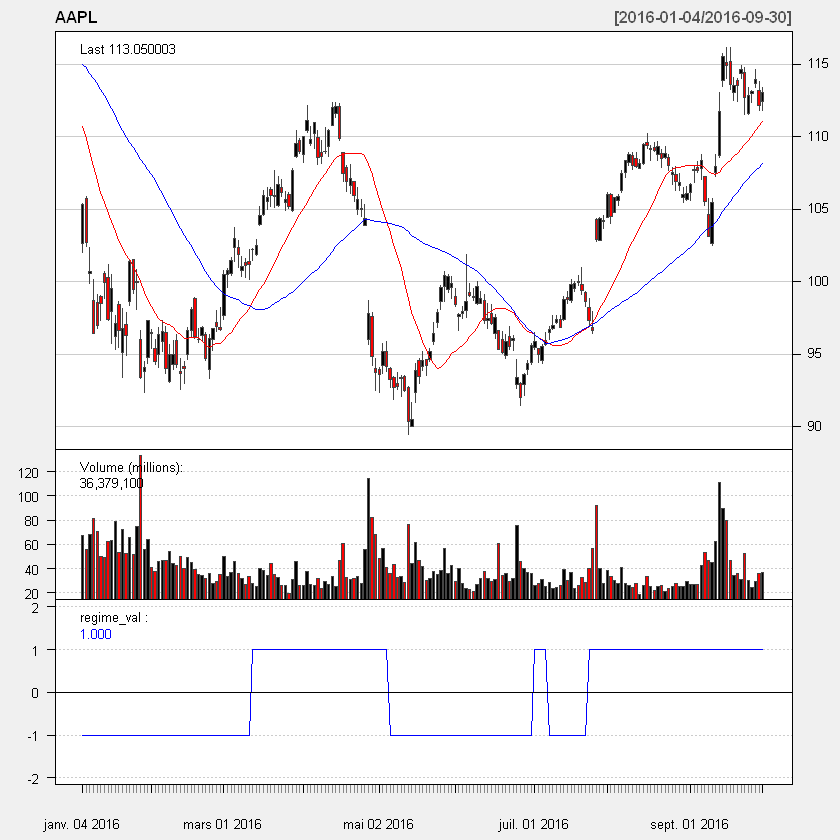


```R
candleChart(AAPL, up.col = "black", dn.col = "red", theme = "white", subset = "2016-01-04/")
addTA(regime_val, col = "blue", yrange = c(-2, 2))
addLines(h = 0, col = "black", on = 3)
addSMA(n = c(20, 50), on = 1, col = c("red", "blue"))
```


```R
table(as.vector(regime_val))
```


      -1    1
     616 1034


The call above indicates that the market was bullish on Apple stock for 987 days, and bearish for 663 days. (If you were following along on the Python version, you may notice there is no 0. This may be due to different behavior by sigComparison().)

Trading signals appear at regime changes. When a bullish regime begins, a buy signal is triggered, and when it ends, a sell signal is triggered. Likewise, when a bearish regime begins, a sell signal is triggered, and when the regime ends, a buy signal is triggered (this is of interest only if you ever will short the stock, or use some derivative like a stock option to bet against the market).

It’s simple to obtain signals. Let $r_t$ indicate the regime at time $t$, and $s_t$ the signal at time $t$. Then:

$$s_t = \text{sign}(r_t - r_{t - 1})$$

$s_t \in \{-1, 0, 1\}$, with -1 indicating “sell”, 1 indicating “buy”, and 0 no action. We can obtain signals like so:


```R
sig <- diff(regime_val) / 2
plot(sig, main = "Signal", ylim = c(-2, 2))
```


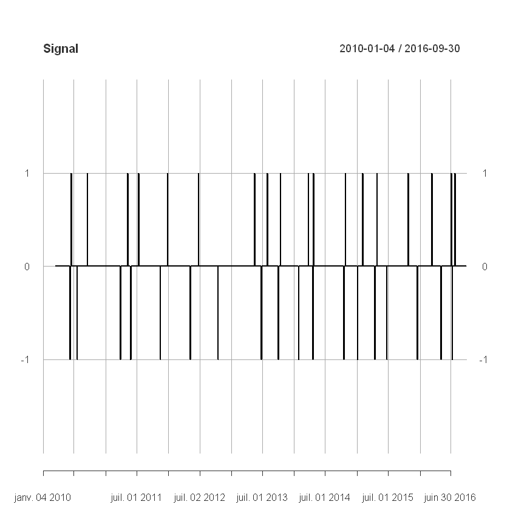


```R
table(sig)
```


    sig
      -1    0    1
      18 1613   18


We would buy Apple stock 18 times and sell Apple stock 18 times. If we only go long on Apple stock, only 19 trades will be engaged in over the 6-year period, while if we pivot from a long to a short position every time a long position is terminated, we would engage in 19 trades total. (Bear in mind that trading more frequently isn’t necessarily good; trades are never free.)

You may notice that the system as it currently stands isn’t very robust, since even a fleeting moment when the fast moving average is above the slow moving average triggers a trade, resulting in trades that end immediately (which is bad if not simply because realistically every trade is accompanied by a fee that can quickly erode earnings). Additionally, every bullish regime immediately transitions into a bearish regime, and if you were constructing trading systems that allow both bullish and bearish bets, this would lead to the end of one trade immediately triggering a new trade that bets on the market in the opposite direction, which again seems finnicky. A better system would require more evidence that the market is moving in some particular direction. But we will not concern ourselves with these details for now.

Let’s now try to identify what the prices of the stock is at every buy and every sell.


```R
# The Cl function from quantmod pulls the closing price from the object
# holding a stock's data
# Buy prices
Cl(AAPL)[which(sig == 1)]
```


               AAPL.Close
    2010-06-18   39.15286
    2010-09-20   40.46143
    2011-05-12   49.51000
    2011-07-14   51.11000
    2011-12-28   57.52000
    2012-06-25   81.53857
    2013-05-17   61.89429
    2013-07-31   64.64714
    2013-10-16   71.58714
    2014-03-26   77.11143
    2014-04-25   81.70571
    2014-10-28  106.74000
    2015-02-05  119.94000
    2015-04-28  130.56000
    2015-10-27  114.55000
    2016-03-11  102.26000
    2016-07-01   95.89000
    2016-07-25   97.34000


```R
# Sell prices
Cl(AAPL)[sig == -1]
```


               AAPL.Close
    2010-06-11   36.21571
    2010-07-22   37.00286
    2011-03-31   49.78714
    2011-05-27   48.20143
    2011-11-17   53.91571
    2012-05-09   81.31143
    2012-10-17   92.08714
    2013-06-26   56.86714
    2013-10-03   69.05857
    2014-01-28   72.35714
    2014-04-22   75.95715
    2014-10-17   97.67000
    2015-01-05  106.25000
    2015-04-16  126.17000
    2015-06-25  127.50000
    2015-12-18  106.03000
    2016-05-05   93.24000
    2016-07-08   96.68000


```R
# Since these are of the same dimension, computing profit is easy
as.vector(Cl(AAPL)[sig == 1])[-1] - Cl(AAPL)[sig == -1][-table(sig)[["1"]]]
```


               AAPL.Close
    2010-06-11   4.245716
    2010-07-22  12.507141
    2011-03-31   1.322857
    2011-05-27   9.318573
    2011-11-17  27.622860
    2012-05-09 -19.417145
    2012-10-17 -27.440002
    2013-06-26  14.720001
    2013-10-03   8.052856
    2014-01-28   9.348571
    2014-04-22  30.782852
    2014-10-17  22.270004
    2015-01-05  24.309998
    2015-04-16 -11.619995
    2015-06-25 -25.239998
    2015-12-18 -10.140000
    2016-05-05   4.099998


Above, we can see that on May 22nd, 2013, there was a massive drop in the price of Apple stock, and it looks like our trading system would do badly. But this price drop is not because of a massive shock to Apple, but simply due to a stock split. And while dividend payments are not as obvious as a stock split, they may be affecting the performance of our system.


```R
candleChart(AAPL, up.col = "black", dn.col = "red", theme = "white")
addTA(regime_val, col = "blue", yrange = c(-2, 2))
addLines(h = 0, col = "black", on = 3)
addSMA(n = c(20, 50), on = 1, col = c("red", "blue"))
zoomChart("2014-05/2014-07")
```


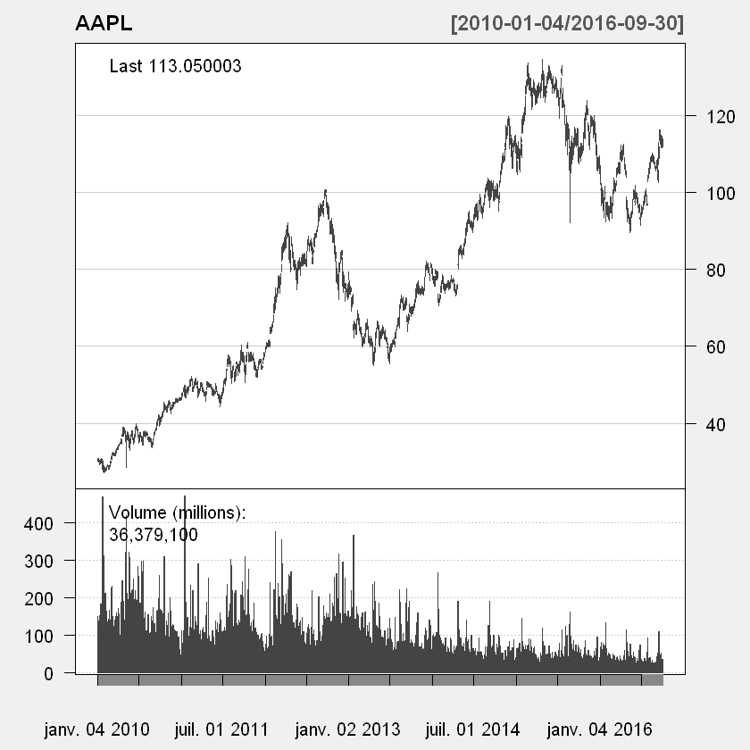


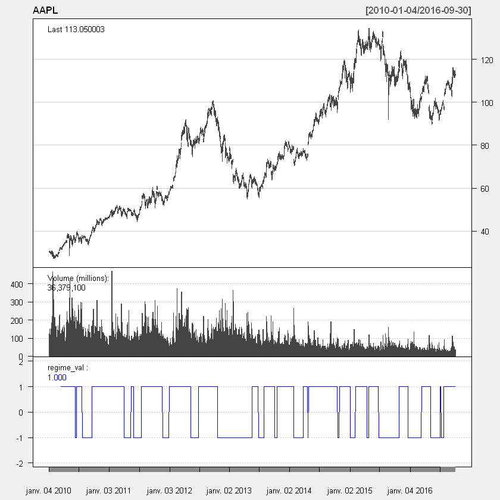


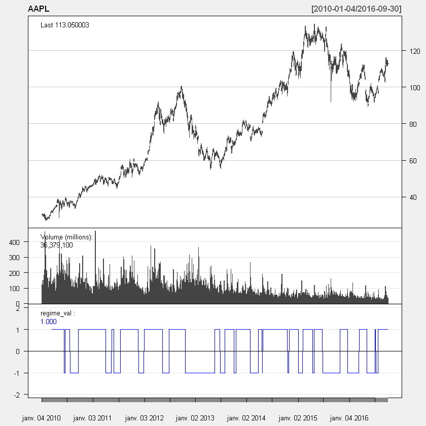


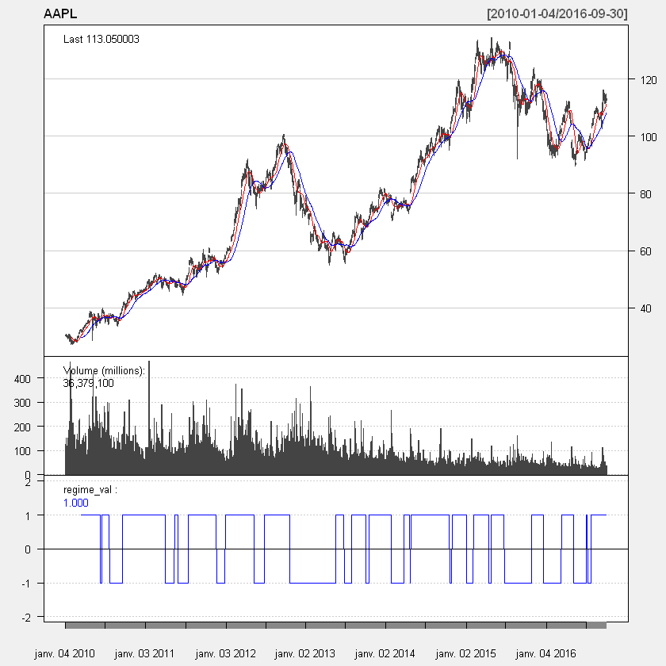


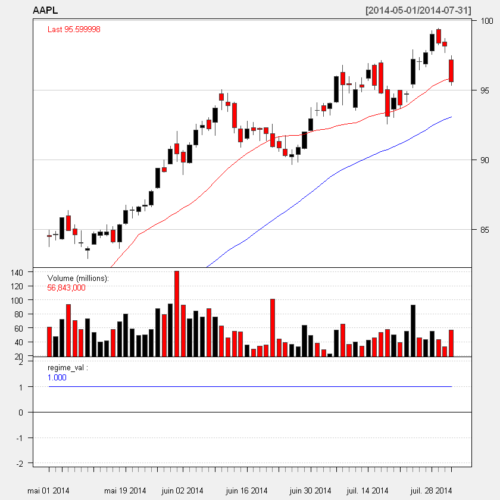


As you can see, adjusting for dividends and stock splits makes a big difference. We will use this data from now on.

Let’s now create a simulated portfolio of $1,000,000, and see how it would behave, according to the rules we have established. This includes:

*    Investing only 10% of the portfolio in any trade
*    Exiting the position if losses exceed 20% of the value of the trade.

When simulating, bear in mind that:

*    Trades are done in batches of 100 stocks (unfortunately, osMaxDollar() will not round to batches of 100, so for the sake of simplicity, this will be ignored).
    Our stop-loss rule involves placing an order to sell the stock the moment the price drops below the specified level. Thus we need to check whether the lows during this period ever go low enough to trigger the stop-loss. Realistically, unless we buy a put option, we cannot guarantee that we will sell the stock at the price we set at the stop-loss, but we will use this as the selling price anyway for the sake of simplicity.
*    Every trade is accompanied by a commission to the broker, which should be accounted for. I do not do so here.

**quantmod** is good for visualizing stock data, but if we want to start developing and testing strategies, we will need to rely more on other packages:

*    **TTR** contains functions for computing technical indicators (simple moving averages, or SMAs, are included).
    blotter is intended to manage portfolios and positions created while developing trading strategies. It provides environments intended to help simplify portfolio tracking tasks.
*    **FinancialInstruments** is a companion package to blotter and stores meta-data about different financial instruments (stocks, options contracts, etc.).
*    **quantstrat** may be the work horse package here; it is used for defining and testing trading strategies.
*    **IKTrading** contains some additional useful functions for trading (in particular, osMaxDollar()).

**quantstrat** and its companion packages provides a flexible framework for backtesting that, in principle, should allow for any trading strategy to be backtested. The following code must be executed for every testing session.

For the sake of simplicity, I’m going to not force orders to be in batches of 100 shares, nor will I enforce the stop-loss rule mentioned above. It is possible to implement these rules, but doing so is not simple. Perhaps in a later article I will revisit these topics. Additionally, I am allowing the strategy to further enter a position in “bullish” markets. I would not recommend this in the real world, since this will drive up transaction costs for little profit. (Rule of thumb; the fewer transactions, the better.)


```R
rm(list = ls(.blotter), envir = .blotter)  # Clear blotter environment
currency("USD")  # Currency being used
```


'USD'


```R
Sys.setenv(TZ = "UTC")  # Allows quantstrat to use timestamps
```

Next, we declare the stocks we are going to be working with.


```R
AAPL_adj <- adjustOHLC(AAPL)
stock("AAPL_adj", currency = "USD", multiplier = 1)
```


'AAPL_adj'


```R
initDate <- "1990-01-01"  # A date prior to first close price; needed (why?)
```

Now we create a portfolio and account object that will be used in the simulation.


```R
strategy_st <- portfolio_st <- account_st <- "SMAC-20-50"  # Names of objects
rm.strat(portfolio_st)  # Need to remove portfolio from blotter env
rm.strat(strategy_st)   # Ensure no strategy by this name exists either
initPortf(portfolio_st, symbols = "AAPL_adj",  # This is a simple portfolio
                                               # trading AAPL only
          initDate = initDate, currency = "USD")
```


'SMAC-20-50'


```R
initAcct(account_st, portfolios = portfolio_st,  # Uses only one portfolio
         initDate = initDate, currency = "USD",
         initEq = 1000000)  # Start with a million dollars
```


'SMAC-20-50'


```R
initOrders(portfolio_st, store = TRUE)  # Initialize the order container; will
                                        # contain all orders made by strategy
```

Now we define the strategy.


```R
strategy(strategy_st, store = TRUE)  # store = TRUE tells function to store in
                                     # the .strategy environment

# Now define trading rules
# Indicators are used to construct signals
add.indicator(strategy = strategy_st, name = "SMA",     # SMA is a function
              arguments = list(x = quote(Cl(mktdata)),  # args of SMA
                               n = 20),
              label = "fastMA")
```


'SMAC-20-50'


```R
add.indicator(strategy = strategy_st, name = "SMA",
              arguments = list(x = quote(Cl(mktdata)),
                               n = 50),
              label = "slowMA")
```


'SMAC-20-50'


```R
# Next comes trading signals
add.signal(strategy = strategy_st, name = "sigComparison",  # Remember me?
           arguments = list(columns = c("fastMA", "slowMA"),
                            relationship = "gt"),
           label = "bull")
```


'SMAC-20-50'


```R
add.signal(strategy = strategy_st, name = "sigComparison",
           arguments = list(columns = c("fastMA", "slowMA"),
                            relationship = "lt"),
           label = "bear")
```


'SMAC-20-50'


```R
# Finally, rules that generate trades
add.rule(strategy = strategy_st, name = "ruleSignal",  # Almost always this one
         arguments = list(sigcol = "bull",  # Signal (see above) that triggers
                          sigval = TRUE,
                          ordertype = "market",
                          orderside = "long",
                          replace = FALSE,
                          prefer = "Open",
                          osFUN = osMaxDollar,
                          # The next parameter, which is a parameter passed to
                          # osMaxDollar, will ensure that trades are about 10%
                          # of portfolio equity
                          maxSize = quote(floor(getEndEq(account_st,
                                                   Date = timestamp) * .1)),
                          tradeSize = quote(floor(getEndEq(account_st,
                                                   Date = timestamp) * .1))),
         type = "enter", path.dep = TRUE, label = "buy")
```


'SMAC-20-50'


```R
add.rule(strategy = strategy_st, name = "ruleSignal",
         arguments = list(sigcol = "bear",
                          sigval = TRUE,
                          orderqty = "all",
                          ordertype = "market",
                          orderside = "long",
                          replace = FALSE,
                          prefer = "Open"),
         type = "exit", path.dep = TRUE, label = "sell")
```


'SMAC-20-50'


With the strategy set up, we now execute it. (I’m allowing the function’s intermediate output to be included; I believe, in this case, it’s nice to see what is going on.)


```R
applyStrategy(strategy_st, portfolios = portfolio_st)
```

    [1] "2010-03-17 00:00:00 AAPL_adj 487 @ 205.901590902581"
    [1] "2010-03-23 00:00:00 AAPL_adj 8 @ 206.57909045847"
    [1] "2010-06-14 00:00:00 AAPL_adj -495 @ 234.337814056279"
    [1] "2010-06-21 00:00:00 AAPL_adj 401 @ 254.232150546073"
    [1] "2010-06-25 00:00:00 AAPL_adj 2 @ 247.246719713266"
    [1] "2010-06-28 00:00:00 AAPL_adj 1 @ 244.381118844726"
    [1] "2010-06-29 00:00:00 AAPL_adj 5 @ 241.808496992579"
    [1] "2010-06-30 00:00:00 AAPL_adj 4 @ 235.02443315763"
    [1] "2010-07-01 00:00:00 AAPL_adj 12 @ 232.818028667299"
    [1] "2010-07-02 00:00:00 AAPL_adj 4 @ 229.32988263664"
    [1] "2010-07-06 00:00:00 AAPL_adj 7 @ 229.796799519074"
    [1] "2010-07-15 00:00:00 AAPL_adj 1 @ 227.260803248315"
    [1] "2010-07-16 00:00:00 AAPL_adj 3 @ 231.792640561977"
    [1] "2010-07-21 00:00:00 AAPL_adj 9 @ 242.69654076987"
    [1] "2010-07-23 00:00:00 AAPL_adj -449 @ 235.37234093309"
    [1] "2010-09-21 00:00:00 AAPL_adj 395 @ 259.88096234889"
    [1] "2011-04-01 00:00:00 AAPL_adj -395 @ 321.450025838474"
    [1] "2011-05-13 00:00:00 AAPL_adj 315 @ 316.460410413866"
    [1] "2011-05-17 00:00:00 AAPL_adj 7 @ 303.95432206538"
    [1] "2011-05-18 00:00:00 AAPL_adj 6 @ 308.04672289783"
    [1] "2011-05-24 00:00:00 AAPL_adj 3 @ 307.158659894513"
    [1] "2011-05-31 00:00:00 AAPL_adj -331 @ 312.285619647153"
    [1] "2011-07-15 00:00:00 AAPL_adj 302 @ 330.660202791346"
    [1] "2011-08-24 00:00:00 AAPL_adj 1 @ 341.921149546188"
    [1] "2011-11-18 00:00:00 AAPL_adj -303 @ 346.910764970795"
    [1] "2011-12-29 00:00:00 AAPL_adj 268 @ 369.322820188372"
    [1] "2011-12-30 00:00:00 AAPL_adj 2 @ 369.423538935017"
    [1] "2012-05-10 00:00:00 AAPL_adj -270 @ 526.042394799503"
    [1] "2012-06-26 00:00:00 AAPL_adj 189 @ 523.066930004154"
    [1] "2012-06-27 00:00:00 AAPL_adj 2 @ 526.426947382377"
    [1] "2012-10-18 00:00:00 AAPL_adj -191 @ 588.074827417589"
    [1] "2013-05-20 00:00:00 AAPL_adj 243 @ 403.916986014337"
    [1] "2013-05-21 00:00:00 AAPL_adj 4 @ 409.7525677237"
    [1] "2013-06-21 00:00:00 AAPL_adj 8 @ 391.366776851679"
    [1] "2013-06-25 00:00:00 AAPL_adj 7 @ 379.40571641309"
    [1] "2013-06-26 00:00:00 AAPL_adj 1 @ 377.722390390489"
    [1] "2013-06-27 00:00:00 AAPL_adj -263 @ 373.373751795704"
    [1] "2013-08-01 00:00:00 AAPL_adj 235 @ 426.211856604443"
    [1] "2013-09-18 00:00:00 AAPL_adj 2 @ 436.020359992876"
    [1] "2013-10-07 00:00:00 AAPL_adj -237 @ 458.029399515811"
    [1] "2013-10-17 00:00:00 AAPL_adj 212 @ 470.662500706081"
    [1] "2014-01-29 00:00:00 AAPL_adj -212 @ 477.169484661655"
    [1] "2014-03-12 00:00:00 AAPL_adj 196 @ 509.134934911657"
    [1] "2014-03-17 00:00:00 AAPL_adj 2 @ 502.648197337851"
    [1] "2014-03-18 00:00:00 AAPL_adj -198 @ 500.933662093936"
    [1] "2014-03-25 00:00:00 AAPL_adj 194 @ 515.793058666234"
    [1] "2014-03-31 00:00:00 AAPL_adj 1 @ 513.630861704657"
    [1] "2014-04-08 00:00:00 AAPL_adj 3 @ 500.257385453302"
    [1] "2014-04-09 00:00:00 AAPL_adj 1 @ 497.828427741636"
    [1] "2014-04-10 00:00:00 AAPL_adj 1 @ 505.486764287656"
    [1] "2014-04-14 00:00:00 AAPL_adj 2 @ 497.123566734484"
    [1] "2014-04-23 00:00:00 AAPL_adj -202 @ 503.943661898308"
    [1] "2014-04-28 00:00:00 AAPL_adj 185 @ 545.60717970635"
    [1] "2014-06-10 00:00:00 AAPL_adj 941 @ 90.7368171626663"
    [1] "2014-06-12 00:00:00 AAPL_adj -1126 @ 90.0759010502085"
    [1] "2014-08-19 00:00:00 AAPL_adj 1054 @ 95.6931692900582"
    [1] "2014-09-11 00:00:00 AAPL_adj 5 @ 96.6557803497063"
    [1] "2014-10-16 00:00:00 AAPL_adj 1 @ 91.9774896372056"
    [1] "2014-10-17 00:00:00 AAPL_adj 27 @ 93.8545783156862"
    [1] "2014-10-20 00:00:00 AAPL_adj -1087 @ 94.6439193845976"
    [1] "2014-10-29 00:00:00 AAPL_adj 985 @ 102.662471436688"
    [1] "2015-01-06 00:00:00 AAPL_adj -985 @ 103.001288430376"
    [1] "2015-02-06 00:00:00 AAPL_adj 858 @ 116.491485509158"
    [1] "2015-02-10 00:00:00 AAPL_adj 11 @ 116.637076575269"
    [1] "2015-04-17 00:00:00 AAPL_adj -869 @ 121.858912853907"
    [1] "2015-04-29 00:00:00 AAPL_adj 766 @ 126.333382759857"
    [1] "2015-04-30 00:00:00 AAPL_adj 25 @ 124.858064939017"
    [1] "2015-05-01 00:00:00 AAPL_adj 9 @ 122.392738351109"
    [1] "2015-05-04 00:00:00 AAPL_adj 17 @ 125.69278245721"
    [1] "2015-05-08 00:00:00 AAPL_adj 5 @ 123.469279769953"
    [1] "2015-06-29 00:00:00 AAPL_adj -822 @ 122.280199845824"
    [1] "2015-10-28 00:00:00 AAPL_adj 885 @ 114.482259314017"
    [1] "2015-11-17 00:00:00 AAPL_adj 28 @ 112.995955565041"
    [1] "2015-12-17 00:00:00 AAPL_adj 2 @ 110.144507689672"
    [1] "2015-12-21 00:00:00 AAPL_adj -915 @ 105.483868873907"
    [1] "2016-03-11 00:00:00 AAPL_adj 997 @ 101.073743853996"
    [1] "2016-04-28 00:00:00 AAPL_adj 56 @ 96.496561342483"
    [1] "2016-05-02 00:00:00 AAPL_adj 23 @ 92.8980829110911"
    [1] "2016-05-06 00:00:00 AAPL_adj -1076 @ 92.8669223571517"
    [1] "2016-06-24 00:00:00 AAPL_adj 1047 @ 92.4094018468721"
    [1] "2016-06-27 00:00:00 AAPL_adj 35 @ 92.4989129454683"
    [1] "2016-06-28 00:00:00 AAPL_adj -1082 @ 92.3994537379766"
    [1] "2016-07-01 00:00:00 AAPL_adj 1064 @ 94.9754947544617"
    [1] "2016-07-12 00:00:00 AAPL_adj -1064 @ 96.6464428592831"
    [1] "2016-07-26 00:00:00 AAPL_adj 1023 @ 96.2983306600025"
    [1] "2016-07-27 00:00:00 AAPL_adj 15 @ 103.708186831476"


Here we effectvely conclude the study so we can perform some analytics.


```R
updatePortf(portfolio_st)
```


'SMAC-20-50'


```R
dateRange <- time(getPortfolio(portfolio_st)$summary)[-1]
updateAcct(portfolio_st, dateRange)
```


'SMAC-20-50'


```R
updateEndEq(account_st)
```


'SMAC-20-50'


Here’s our first set of useful summary statistics.


```R
tStats <- tradeStats(Portfolios = portfolio_st, use="trades",
                     inclZeroDays = FALSE)
tStats[, 4:ncol(tStats)] <- round(tStats[, 4:ncol(tStats)], 2)
print(data.frame(t(tStats[, -c(1,2)])))
```

                         AAPL_adj
    Num.Txns                86.00
    Num.Trades              22.00
    Net.Trading.PL        4730.59
    Avg.Trade.PL           215.03
    Med.Trade.PL           159.92
    Largest.Winner       42314.08
    Largest.Loser       -84895.21
    Gross.Profits       130978.85
    Gross.Losses       -126248.25
    Std.Dev.Trade.PL     22490.27
    Std.Err.Trade.PL      4794.94
    Percent.Positive        50.00
    Percent.Negative        50.00
    Profit.Factor            1.04
    Avg.Win.Trade        11907.17
    Med.Win.Trade         7521.14
    Avg.Losing.Trade    -11477.11
    Med.Losing.Trade     -3234.16
    Avg.Daily.PL          -597.45
    Med.Daily.PL           -13.90
    Std.Dev.Daily.PL     22712.42
    Std.Err.Daily.PL      4956.26
    Ann.Sharpe              -0.42
    Max.Drawdown       -118900.37
    Profit.To.Max.Draw       0.04
    Avg.WinLoss.Ratio        1.04
    Med.WinLoss.Ratio        2.33
    Max.Equity          103650.48
    Min.Equity          -15249.89
    End.Equity            4730.59


```R
final_acct <- getAccount(account_st)
plot(final_acct$summary$End.Eq["2010/2016"], main = "Portfolio Equity")
```


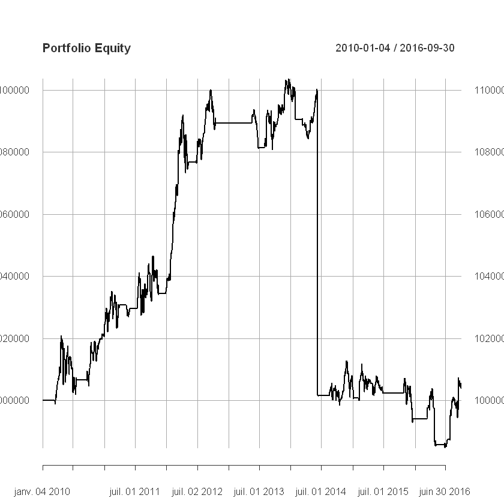


```R

```
